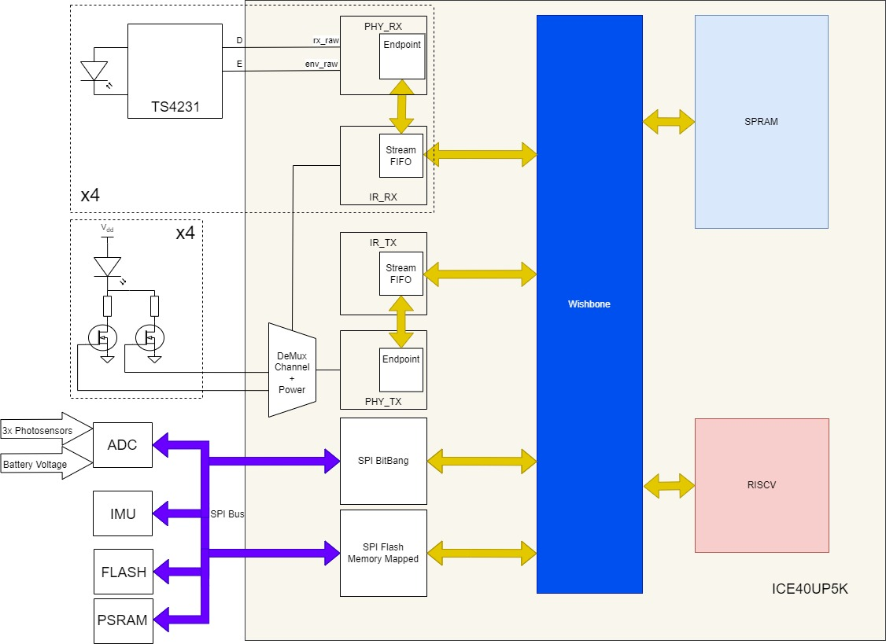
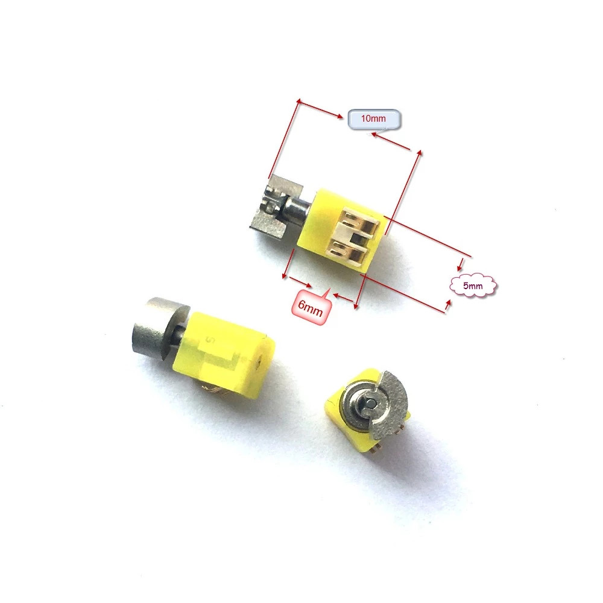
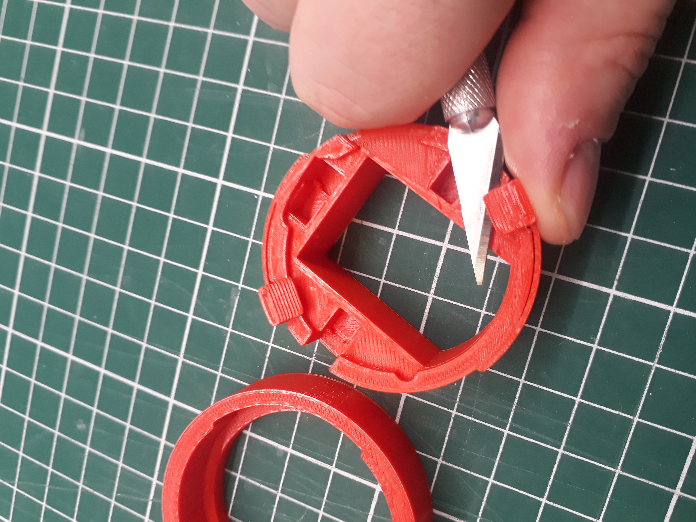
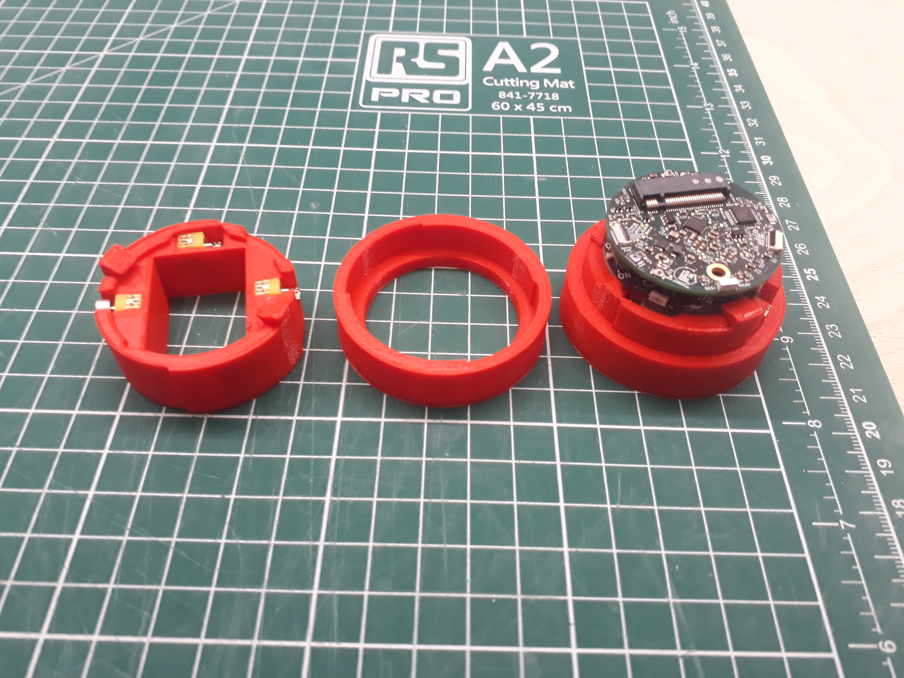
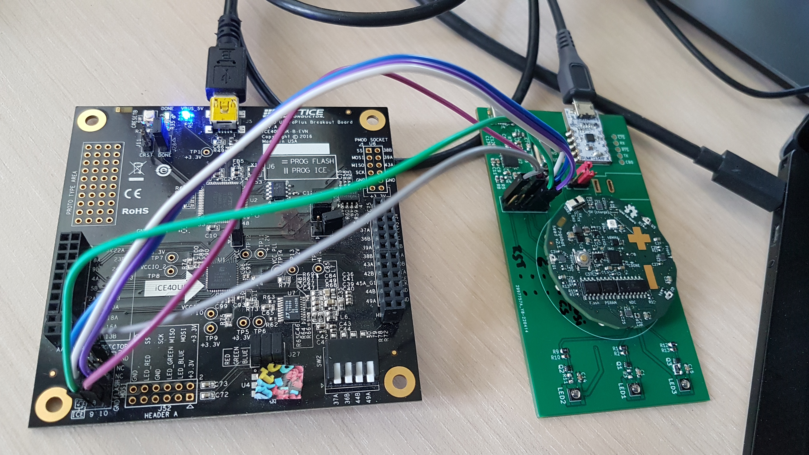
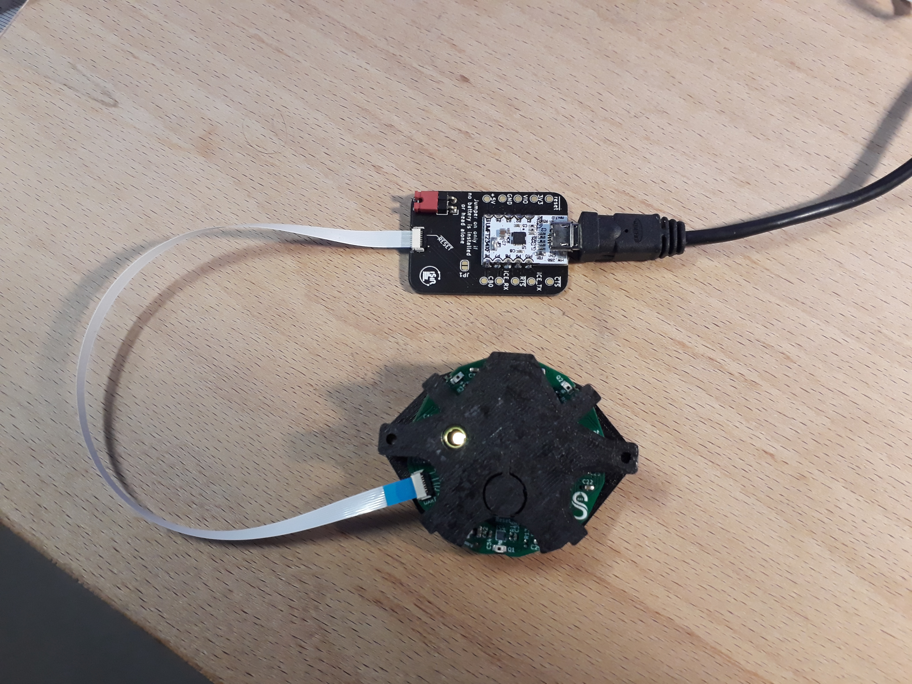
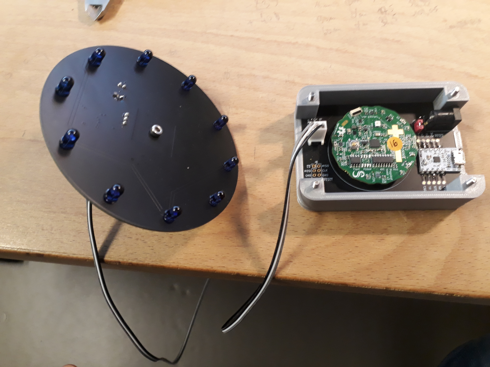
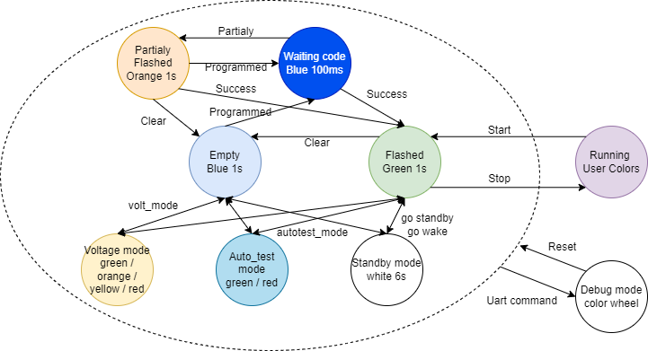
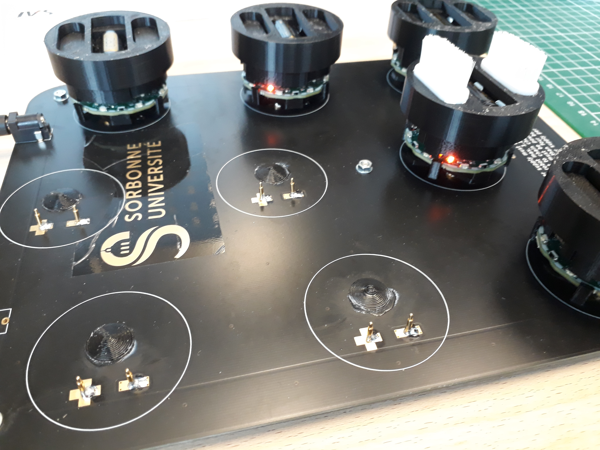

# Pogobot

## Table of contents 

- [Pogobot](#pogobot)
  - [Table of contents](#table-of-contents)
  - [Overview](#overview)
    - [Git description](#git-description)
    - [Software API](#software-api)
    - [Hardware schematic](#hardware-schematic)
  - [Hardware](#hardware)
    - [Motor information](#motor-information)
    - [3d printed parts](#3d-printed-parts)
      - [Printing info](#printing-info)
      - [Assembly](#assembly)
    - [Programming the robot (hardware part)](#programming-the-robot-hardware-part)
  - [Software](#software)
    - [Repository clone](#repository-clone)
    - [Install all the dependency](#install-all-the-dependency)
    - [Adding your user to Dialout group](#adding-your-user-to-dialout-group)
    - [Compile gateware and pogobios (Has to be done once)](#compile-gateware-and-pogobios-has-to-be-done-once)
    - [Compile the SDK (Has to be done once too)](#compile-the-sdk-has-to-be-done-once-too)
    - [Compile and test "HelloWorld"](#compile-and-test-helloworld)
    - [Compile and upload your application](#compile-and-upload-your-application)
    - [Upload a empty or faulty robot](#upload-a-empty-or-faulty-robot)
    - [Memory map](#memory-map)
    - [Install on Linux distributions other than Ubuntu by using Singularity Containers](#install-on-linux-distributions-other-than-ubuntu-by-using-singularity-containers)
  - [IR Remote](#ir-remote)
    - [Hardware](#hardware-1)
    - [Software](#software-1)
    - [Usage](#usage)
    - [Pogobios LED Status](#pogobios-led-status)
  - [Tools](#tools)
    - [version\_creation\_litex.sh](#version_creation_litexsh)
    - [Doc generation](#doc-generation)
  - [Pogobot Charger](#pogobot-charger)
  - [Kwown Issues](#kwown-issues)
    - [yosys-abc](#yosys-abc)
    - [nextpnr](#nextpnr)


## Overview 
The pogobot is a small robot designed for swarm robotics experiments, targeted at collective behaviour and social learning research.
The robot is composed of a head (above) with a iCE40UP5K FPGA chip including a softcore processor, an IMU, fast Infra-Red communication devices and a LED.
The head is plugged on a belly (under) which composed of even more LEDs, the motor controler, the battery and the battery regulation system.

### Git description
This project is divided into 3 folders :
- Hardware
- Software
- Tools

Hardware contains the schematics and other files to build your own robot from scratch. 

All the schematics were done using KiCad 6. You can find : 
- 'Belly' folder with the belly schematics
- 'Head' folder with the head schematics
- '3d-addons' folder contains all the 3D parts to print to complete a robot
- '3Dmodels' and other folders regroups all the libraries, 3D models and foorprints for KiCad.
   
Software contains the gateware / software / SDK builder to upload inside the robot.
It exists 2 softwares inside the robot. 
- The bootloader is the one called when you boot the robot. It contains a gateware and the pogobios.
- The user space is called by a command inside the bootloader. It contains your code and a gateware.
  
Tools corresponds to the differents tools used around the robot.

### Software API
The robot API is described inside [pogodocs.md](pogodocs.md). <br> 
Most of the information is contained inside pogolib/pogobot.h but if you want to go deeper, the best is to browse pogolib and pogobios. 

### Hardware schematic
Here you can find the global view of the hardware.



## Hardware
In order to complete a robot, you will need : 
- a belly and a head
- a 3v CR2 rechargeable Batery (Li-FePO4)
- 3 motors
- the different 3d printed parts

### Motor information
All the models are designed for the motors available here:
https://www.aliexpress.com/item/32918768766.html



### 3d printed parts
All the parts are available inside the folder 'Hardware/3d-addons'.

#### Printing info
The different models have been printed in PLA with an Ultimaker2+ with a layer height of 0.2mm without support or brim.

To assemble a robot, you need to print a skirt, a capsule and a hat for the version of your belly. <br>
After printed the capsule, you have to set free the tabs by gently cut under.



HINT: The hat has to be returned to be printed without support.

#### Assembly
- First, place the motors inside the 3 holes.
- Then, place the robot inside the capsule.
- Finally, place the robot+capsule inside the skirt.



### Programming the robot (hardware part)
In order to program the robot, you need a USB to UART device connected between your computor and the FFC/FPC connector on the head. 
The folder 'Hardware/usb-uart-progboard' contains the Kicad files to produce a small board to program the robot. 
You also need :
- UMFT234XF board (https://www.mouser.fr/ProductDetail/FTDI/UMFT234XF?qs=NVftvxkm2thPJLzIkoAhbA%3D%3D)
- a FFC/FPC connector (8 pins, 0.5 mm, SMD/SMT, Right Angle, Dual Contact) like https://www.mouser.fr/ProductDetail/571-2328702-8
- a FFC/FPC cable (8 pins, 0.5 mm) like https://www.mouser.fr/ProductDetail/538-15166-0087
- a USB micro => USB cable

## Software

The Software is divided between the code for the FPGA (gateware) and the code for the softcore (software). 

:warning: Everything was tested with Ubuntu 20.04

### Repository clone
    git clone https://github.com/nekonaute/pogobot.git
    cd pogobot


### Install all the dependency

Create dependencies directory

    mkdir -p dependencies

**system dependency**

The list is adapted for Ubuntu distribution

    sudo apt-get -y install bison build-essential clang clang-format cmake flex gawk git graphviz libboost-all-dev libboost-dev libboost-filesystem-dev libboost-iostreams-dev libboost-program-options-dev libboost-python-dev libboost-system-dev libboost-thread-dev libeigen3-dev libffi-dev libftdi-dev libreadline-dev mercurial pkg-config python python3 python3-dev python3-pip python3-setuptools qt5-default tcl-dev xdot zlib1g-dev

    sudo pip3 install meson ninja
    echo "export PATH=\"\$PATH:~/.local/bin\"" >>~/.bashrc

**litex + migen**

From https://github.com/enjoy-digital/litex

    mkdir -p dependencies/litex
    cd dependencies/litex
    wget https://raw.githubusercontent.com/enjoy-digital/litex/master/litex_setup.py
    chmod +x litex_setup.py
    ./litex_setup.py init 

    cat ../../litex_version.txt | awk '{ if(!system("test -d " $1)) {system("git -C " $1 " checkout " $3)}}'

    sudo ./litex_setup.py install

Recover the Cross Compiler

    wget https://static.dev.sifive.com/dev-tools/freedom-tools/v2020.08/riscv64-unknown-elf-gcc-10.1.0-2020.08.2-x86_64-linux-ubuntu14.tar.gz
    tar xvf riscv64-unknown-elf-gcc-10.1.0-2020.08.2-x86_64-linux-ubuntu14.tar.gz

    export GCC_RISCV=$PWD/riscv64-unknown-elf-gcc-10.1.0-2020.08.2-x86_64-linux-ubuntu14/bin/
    echo "export PATH=\"\$PATH:$GCC_RISCV\"" >>~/.bashrc


Notice the option `update` of litex_setup.py have a high probability to break the project.

**icestorm**

From [Icestorm installation
instructions](http://www.clifford.at/icestorm/#install):


    mkdir -p dependencies
    cd dependencies
    git clone https://github.com/cliffordwolf/icestorm.git icestorm
    cd icestorm
    git checkout 2bc541743ada3542c6da36a50e66303b9cbd2059
    NPROC=$(  grep -i "^processor" /proc/cpuinfo | wc -l )
    make -j${NPROC} 
    sudo make install

**yosys**

From [Yosys
Setup](https://github.com/YosysHQ/yosys#user-content-setup "GitHub - YosysHQ/yosys: Yosys Open SYnthesis Suite"):

    mkdir -p dependencies
    cd dependencies
    git clone https://github.com/YosysHQ/yosys
    cd yosys
    git checkout tags/yosys-0.18
    NPROC=$(  grep -i "^processor" /proc/cpuinfo | wc -l )
    make -j${NPROC}
    sudo make install

**nextpnr**

From nextpnr/README.md :

    mkdir -p dependencies
    cd dependencies
    git clone https://github.com/YosysHQ/nextpnr
    cd nextpnr
    git checkout 8d063d38b148b1e7095a032ffc9cf957c2407f32
    cmake . -DARCH=ice40
    NPROC=$(  grep -i "^processor" /proc/cpuinfo | wc -l )
    make -j${NPROC}
    sudo make install

**Tests**

*Test litex*

    python3 -m litex.soc.integration.soc_core && echo SUCCESS

Bad:

    .../python3: No module named litex.soc.integration.soc_core

Good:

    SUCCESS

*Test migen*

    echo "from migen import *" | python3 && echo "MIGEN SUCCESS"

Bad:

    Traceback (most recent call last):
      File "<stdin>", line 1, in <module>
    ImportError: No module named migen

Good:

    MIGEN SUCCESS

*Test yosys*

    echo | yosys && echo "YOSYS SUCCESS"

Bad:

    yosys: command not found

Good:

    (many lines)
    YOSYS SUCCESS

*Test icestorm*

    icebox_diff

Bad:

    icebox_diff: command not found

Good:

    Usage: icebox_diff bitmap1.asc bitmap2.asc

*Test nextpnr*

    nextpnr-ice40

Bad:

    nextpnr-ice40: command not found

Good:

    nextpnr-ice40 -- Next Generation Place and Route (...)
    (many lines)

*GCC Toolchain*

    riscv64-unknown-elf-addr2line

Bad:

    riscv64-unknown-elf-addr2line: command not found

Good:

    riscv64-unknown-elf-addr2line: « a.out »: pas de tel fichier

### Adding your user to Dialout group

    sudo adduser $USER dialout

Reboot the PC.

### Compile gateware and pogobios (Has to be done once)

You have to go in the folder 'Software'

    cd Software

The following command recompile the gateware, compile the dependencies and the pogobios. (Has to be done once)

    ./pogosoc.py --target=pogobotv3 --cpu-variant=lite --build

The next command uploads the new gateware and flash the pogobios as an application. (Has to be done once)

    ./litex_term.py --serial-boot --images images.json --safe /dev/ttyUSBX

    You have to change X for the correct number 

If you want or need to change the bootloader, you need to execute the folowing commands.<br>
:warning: These commands can break your pogobot

    ./pogosoc.py --target=pogobotv3 --cpu-variant=lite --build --bootloader
    ./litex_term.py --serial-boot --images images.json --safe /dev/ttyUSBX

    You have to change X for the correct number 

### Compile the SDK (Has to be done once too)

It is possible to extract only a software sdk that will work with the gateware from the user space already in the robot.
The software compile with a lot of file produice with the gateware so the SDK is gateware version dependant.<br>
:warning: If no gateware is available, the robot will not run the code successfuly.<br>
:warning: If the gateware is not compatible, the robot can have some random behavior.<br>

    cd sdk
    make

All the files needed are available in the folder 'build_sdk' and can be moved where is needed.

### Compile and test "HelloWorld"

:warning: All the examples use the SDK in order to compile. Don't forget to compile the SDK before. <br>
The error below is typical of this oversight.

    Makefile:9: ../../sdk/build_sdk/tools/common.mak: Aucun fichier ou dossier de ce type
    make: *** Aucune règle pour fabriquer la cible « ../../sdk/build_sdk/tools/common.mak ». Arrêt.

In order to test and duplicate code, you can explore the 'example' folder.

    cd pogobot/Software/example/helloworld
    make clean all

To connect using the debugging cable 

    make connect TTY=/dev/ttyUSBX

    You have to change X for the correct number 
 
    Tape "Enter" to access the prompt
    The "serialboot" command uploads and runs the application code inside the flash of the robot.
    The "run" command start the last uploaded application.

    To exit, you have to press  Crtl + C   Ctrl + C

### Compile and upload your application 

The easiest way to create a new application is to duplicate "helloworld" where is pleased you.<br>
Do not forget to change the PATH to the builded SDK inside the Makefile.

### Upload a empty or faulty robot

Connection with our custom board :

|      |  C0| C1 |      |
|-----:|----|---:|------|
|    X | -o | o- | X    |
| MISO | -o | o- | MOSI |
|  CLK | -o | o- | CS   |
|  GND | -o | o- | X    |
|    X | -o | o- | X    |
|  RST | -o | o- | X    |

Prog SPI flash with FTDI (lattice ice40 Ultraplus Breakout board) :

- Connect the Lattice board.
- Connect GND between both board.
- Connect CS=>SS, SCK=>CLK, FLASH MISO=>MSIO, FLASH MOSI=>MOSI.
- Connect RST=>GND or press the RESET button on top during upload.
- Connect the DEBUG USB (White board) only for the power



Execute :

    iceprog build/bootloader_pogobotv3/bootloader.bin

:warning: If iceprog can't find the board but dsmesg show that everything is ok.

Create a file /etc/udev/rules.d/53-lattice-ftdi.rules with the following line in it to allow uploading bit-streams to a Lattice iCEstick and/or a Lattice iCE40-HX8K Breakout Board as unprivileged user:

    ATTRS{idVendor}=="0403", ATTRS{idProduct}=="6010", MODE="0660", GROUP="plugdev", TAG+="uaccess"

Prog SPI flash directly with bus-pirate :

    ../flashrom/flashrom --p buspirate_spi:dev=/dev/ttyUSB0 -w build/pogobotv3/gateware/pogobotv3_flashrom.bin 

### Memory map

This table shows addresses in flash memory. The flash memory itself is mapped in the system at address 0x200000 (SPIFLASH_BASE).


| Address in flash | Size                             | Zone size | Content          |
|------------------|----------------------------------|-----------|------------------|
| 0                | 0xa0                             | 0xa0      | Multiboot header |
| 0xa0             | 0x1969a                          | 0x20000   | Gateware         |
| 0x20000          | Size of pogobios (usually <64KB) | 0x20000   | Pogobios         |
| 0x40000          | 0x1969a                          | 0x20000   | User gateware    |
| 0x60000          | Size of user code                | 0x20000   | User software    |


### Install on Linux distributions other than Ubuntu by using Singularity Containers

It is possible to build a [Singularity](https://docs.sylabs.io/guides/3.0/user-guide/index.html)/[Apptainer](https://apptainer.org/) image based on Ubuntu 20.04, which could then be used on any Linux distribution.
It may also be used to compile and install the sdk (including dependencies) if you have difficulties following the normal install procedure.

First, you need to install Singularity.
On Debian/Ubuntu distributions:
```bash
sudo apt update
sudo apt install -y wget lsb-release
export DISTRIB_NAME=$(lsb_release -c | cut -f 2)
wget https://github.com/sylabs/singularity/releases/download/v3.10.4/singularity-ce_3.10.4-${DISTRIB_NAME}_amd64.deb 
# Alternatively, download one of the .deb package available at https://github.com/sylabs/singularity/releases
sudo apt install -y ./singularity-ce_3.10.4-${DISTRIB_NAME}_amd64.deb
```
On other distributions, follow the procedure from [the official documentation](https://docs.sylabs.io/guides/3.0/user-guide/installation.html).

After that, you will need to either download an already compiled pogobot.sif image, or build it yourself.
To download an already compiled image:
```bash
cd pogobot
singularity pull --arch amd64 pogobot.sif library://leo.cazenille/pogobot/pogobot:latest
```
*Alternative*: to build it yourself (can take some time):
```bash
cd pogobot
sudo singularity build -F pogobot.sif pogobot.def
```
This will create a "pogobot.sif" image file (size: around 2GB).

Note that the singularity image contains all required applications to use the SDK -- however you'll still need to install SDK dependencies on your local computer, and compile the SDK. In order to do that, use the following commands:
```bash
cd pogobot
singularity run --app install_dep pogobot.sif
singularity run --app compile_sdk pogobot.sif
```

You can then test if the compilation of the SDK was successful:
```bash
singularity run --app test_install pogobot.sif
```

To compile the helloworld example:
```bash
cd Software/example/helloworld
singularity run --app make ../../../../pogobot.sif
```
or:
```bash
cd Software/example/helloworld
singularity exec ../../../../pogobot.sif make clean all
```


## IR Remote
To control each robot, two ways are possible: by cable (debug mode) or by IR.
In order to control robots by IR, you need to create a IR remote.

### Hardware
2 type of IR remote are available. A small one and one with a shower. 

The small one is combination of a pogobot head + usb-uart-progboard + 3D structure (available in the "3d-addons" folder) + 2 M3x10mm screws.



The big one is combination of a pogobot head + remote + remote_Leds_strip + 3D structure



### Software
In order to turn a head into a remote control, we need to put a special user code.

    ./pogosoc.py --target=pogobotv3 --cpu-variant=lite --remocon

Connect to the robot with the command

    ./litex_term.py --serial-boot --images pogobios.json --safe /dev/ttyUSBX

Type the command

    serialboot

in order to upload the code. The robot reboot on the remote control code.


### Usage

Connect the remote from the folder where the usercode was compiled.

    make connect (TTY=/dev/ttyUSBX) (tty of the remote)

When a remote starts, it exposes the standard pogobot bios. You need to start the remote bios by typing : 

    run

A remote can't execute the command "run" and the command "serialboot" has a different meaning.
Once started different new commands are avaible :

- rc_start : start the user code on the robot (continious).
- rc_stop  : stop the user code and restart inside the pogobot bios (continious).
- rc_erase : erase the user code on the robot (continious).
- rc_send_bios_cmd <cmd> <args> : send the pogobios command by IR (once). 
- rc_send_bios_cmd_cont <delay> <cmd> <args> : send the pogobios command by IR every delay Ms (continious). 
- rc_send_user_msg <msg> : send the message by IR. It is not interpreted by the pogobios. The message type is 1. 
- rc_send_user_msg_cont <delay> <msg> : send the message by IR every delay Ms. It is not interpreted by the pogobios. The message type is 1 (continious). 
- serialboot : send the user code to the robots depending on the folder (once).  

To program a robot by IR, you need to clean the robots and reprogram its.<br>
Reboot the robot. The robots blink slowly green if a program is available. (if it is blue, no program available, no erase needed)<br>
"rc_erase" will erase the program and make its blink blue slowly. <br>
The command "serialboot" send to the robots a special command to switch to listen mode. Robots blink blue rapidily. <br>
When the programmation is done, the robots blink green slowly. <br>
If the robots blink orange, the programmation is partiel. Change the distance or angle of the remote and start again the "serialboot" command.


### Pogobios LED Status



## Tools

### version_creation_litex.sh
This script is used to identify the state of all folders from litex.<br>
You have to execute the script inside the 'litex' folder to generate a file.

### Doc generation

To generate the docs, we used a opensource project that transform .h to .md. <br>
(Requires node.js and npm to be installed on computer.)

    git https://github.com/ah01/h2md
    npm install
    cd h2md
    git checkout 21a7918a888084c20a27a9a0a8645a4e988d1bb5

Copy the custom pattern pogobot/tools/pogobot.js inside h2md/lib/patterns/

Add a return carrier to be understand by the tools
    
    awk '{printf "%s\r\n", $0}' /path/to/pogobot.h > pogobot.crlf

Generate docs using our own pattern

    node h2md.js pogobot.crlf -o /path/to/pogodocs.md -p pogobot -l

Remove tempory file

    rm  pogobot.crlf

## Pogobot Charger

There is two ways to recharge a pogobot:
- by the programming cable
- by the plus and minus pads on the head

In order to charge multiple robot at once, we develop a charger using pogopins that connect the plus and minus on the head of the robot by flipping the robot.



The PCB cad files are available in the folder.
The pogopin used are these : https://www.digikey.fr/en/products/detail/preci-dip/90224-AS/5451911
We also used one power jack 5.1 embase connected to the power outlet. The second one is used, if you want to daisy chain multiple PCB (be careful, the total amps used).
:warning: The power plug has to expose the +5v on the inner contact and Ground on the outer contact. Please verify with a voltmeter before pluggin a robot.

We developed some small feet to mount with M3 screws on the PCB and some small cones in order to help the contacts for each robot.
Both 3d designs are available in the folder "3d-addons" (pogocharger*).

## Kwown Issues
This section descibes some isolated issues and the woraround used.

### yosys-abc
During the compiling of the gateware.
```
./pogosoc.py --cpu-variant=lite --build

ERROR: ABC: execution of command "/usr/local/bin/yosys-abc -s -f /tmp/yosys-abc-DDD80t/abc.script 2>&1" failed: return code 127. [...] OSError: Error occured during Yosys/Nextpnr's script execution.
```
It seems that yosys-abc is missing from the PATH but it is here.
libreadline can have the wrong version. 
You can do this workaround (to adapt in your case).
```
sudo ln -s /lib/x86_64-linux-gnu/libreadline.so.8 /lib/x86_64-linux-gnu/libreadline.so.7
```
### nextpnr
During the installation of nextpnr, the line "cmake . -DARCH=ice40" can block.
You can do the following workaround.

Comments the line "cmake policy(SET CMP0079 NEW)" in the file "pogobot/dependencies/nextpnr/CMakeLists.txt". 
(This line is at the begining of the file)


