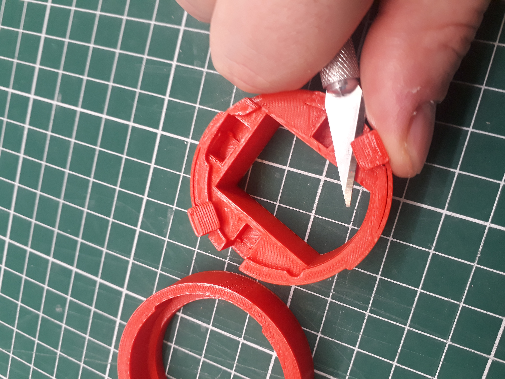
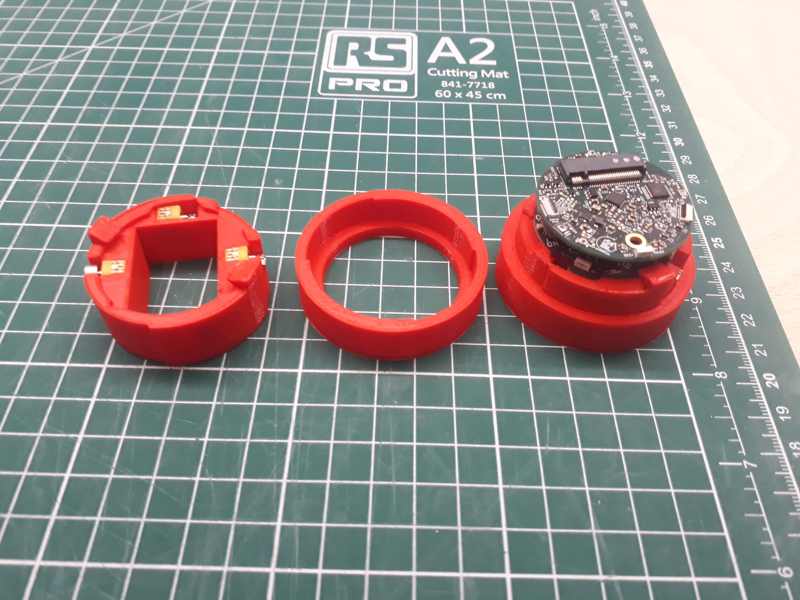

# Robot Assembly
## Pogobot 2026

_not yet written_

## Pogobot 2023

### Printing info
The different models have been printed in PLA with an Ultimaker2+ with a layer height of 0.2mm without support or brim.

To assemble a robot, you need to print a skirt, a capsule and a hat for the version of your belly.  
After printed the capsule, you have to set free the tabs by gently cut under.

HINT: The hat has to be returned to be printed without support.

### 3D parts Assembly
- First, place the motors inside the 3 holes.
- Then, place the robot inside the capsule.
- Finally, place the robot+capsule inside the skirt.

